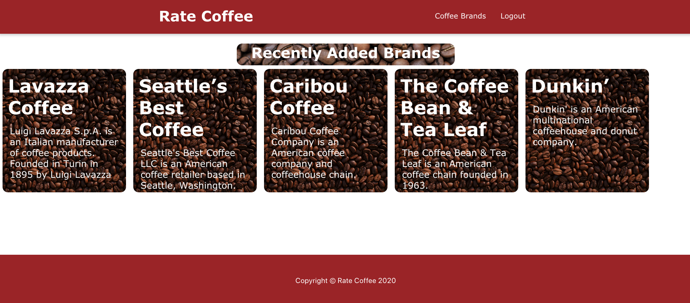
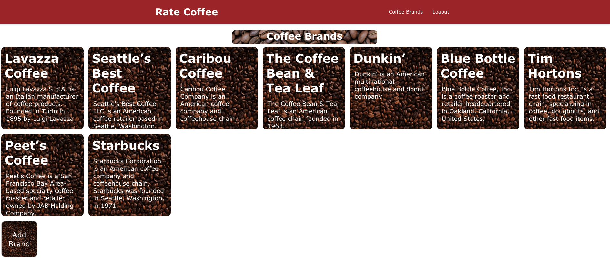
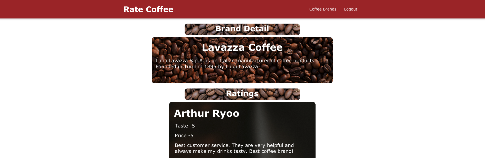

# Rate Coffee App
The Rate Coffee App is a MERN web application rating coffee brand.

# Screenshots

# Technologies Used

- HTML, CSS, JavaScript, React
- Node.js, Express.js, MongoDB, Mongoose
- Token based authentication with JWT

# [Getting Started](http://rate-coffee-app.herokuapp.com/)

1. Sign up with your credentials.
1. Go to Coffee Brands and click Add Brand button.
1. Create brand with name and description.
1. Click the brand card you created.
1. Click Rate Brand button and submit your review.

# Next Steps

* A user should be able to click on an individual coffee brand and update and delete a comment.
* A user should be able to use a fully functional rating system.
* A user should be able to see each brand image on brand card.
